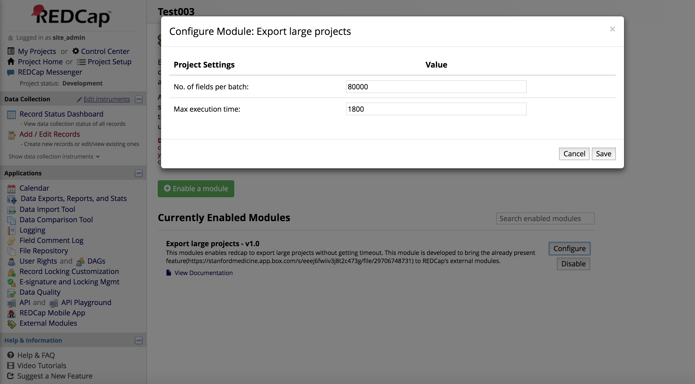
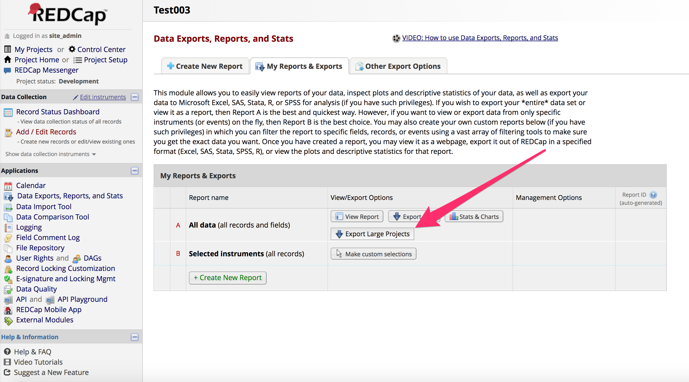
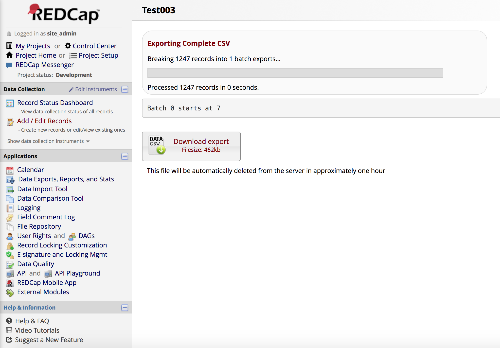

# Export Large Project
This is a REDCap external module that provides functionality to export large projects.

## Installation
- Clone this repo into `<redcap-root>/modules/export_large_projects_v<version_number>`.
- Go to **Control Center > Manage External Modules** and enable Export Large Projects.
- Go to your project home page, click on **Manage External Modules** link, and then enable Export Large Projects.

## Configuration
Access External Modules from the Control Panel to set the number of fields exported in each batch and the maximum execution time for the entire export.

## How to use?
Once this module is enabled for a project, go to "Data Exports, Reports, and Stats" section. In here Export Large Projects button is present as shown in the below image.
Click that button then the data present in the project is copied in chunks and finally saved as a single csv file. And finally download link is given to download this file.

